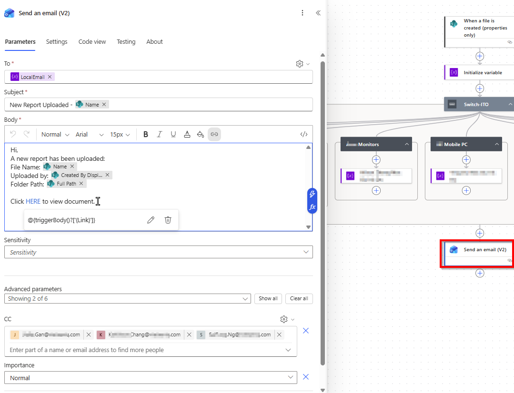
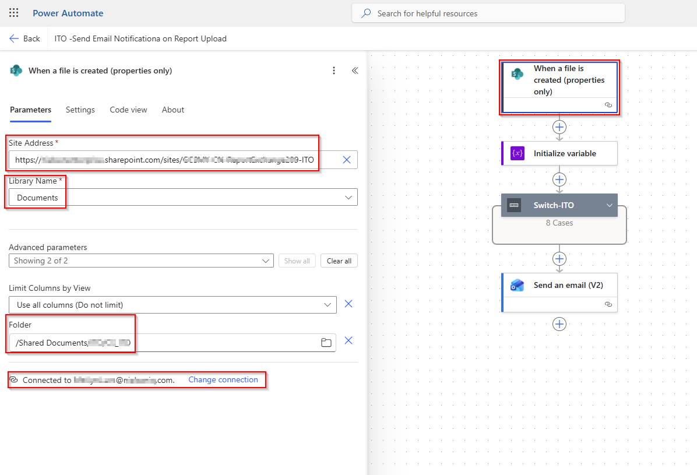

# Power Automate Workflow for Report Notifications
This project automates email notifications when new reports are uploaded to SharePoint, using Microsoft Power Automate.
It eliminates manual announcements and reduces communication time。
## Features
- Trigger: When a new file is uploaded to a specific SharePoint folder.
- Action: Send an automated email to stakeholders.
- Dynamic Content: Includes report name, creator, and direct access link.
- Outcome: Improved efficiency and timely updates.
## Technologies
- Microsoft Power Automate
- SharePoint

## How the Flow Works
The flow is designed to automatically notify relevant stakeholders when a report is uploaded to a SharePoint document library.
1. Trigger  
The flow starts when a file is created in the specified SharePoint library using
When a file is created (properties only).

2. Initialize Variable  
A variable is initialized to store routing or classification information used later in the flow.

3. Switch Control  
A Switch action is used to route the logic based on predefined categories (e.g. device type or report owner).
Each case manages a different group responsible for that category.

4. Send Email Notification  

After the routing logic is completed, an email notification is sent using 
`Send an email (V2)`.

The email includes:
- File name
- Uploader information
- Folder path
- Direct link to the document

This structure keeps the flow scalable and easy to maintain when new categories are added.

## 🧱 Flow Architecture

### Design considerations:

- Modular branching using Switch instead of multiple Condition actions
- Clear separation between trigger, routing logic, and notification
- Easy to extend by adding new cases without changing existing logic

## ✨ Key Features

✅ Automatic email notification on SharePoint upload  
✅ Centralized routing using Switch control  
✅ Supports multiple categories / device groups  
✅ Uses dynamic content (file name, link, uploader)  
✅ Minimal manual intervention required  

## ⬇️ Import & Setup

1. Go to **Power Automate** → **My flows** → **Import**
2. Upload the ZIP file located in the flow/ folder
3. During import:  

During the import process, connections must be bound to the correct environment.

- Bind the **SharePoint connection** to the target site and document library
- Bind the **Outlook (Send an email V2)** connection to the appropriate user account

Example configuration (sensitive information redacted):

4. Update parameters if required:

- SharePoint Site URL
- Document Library
- Email recipients

5. Complete import and Turn on the flow

## 🛠 Customization
You can easily customize this flow to match different business needs:

- Add new categories
Add new cases in the Switch action.

- Change notification content
Modify the subject and body in the Send an email (V2) action.

- Adjust routing logic
Update variable assignment rules to control how files are categorized.

## 💡 Business Value
This automation helps to:

- Reduce manual follow-up after report uploads
- Improve visibility and response time
- Minimize missed reports or delayed actions
- Standardize notification processes across teams  

It is especially useful for operations, IT support, and reporting workflows where timely awareness is critical.

## Email Notification Example
Below is an example of the automated email sent when a report is uploaded to SharePoint.

## Use Cases

- Report distribution and governance
- IT / Operations reporting
- Cross-team document tracking
- Any SharePoint-based submission workflow

